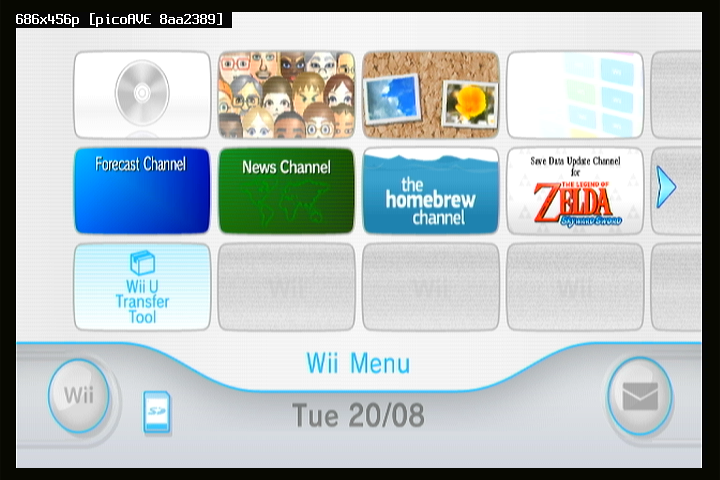
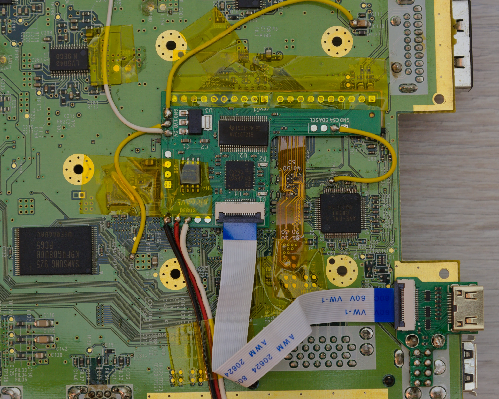
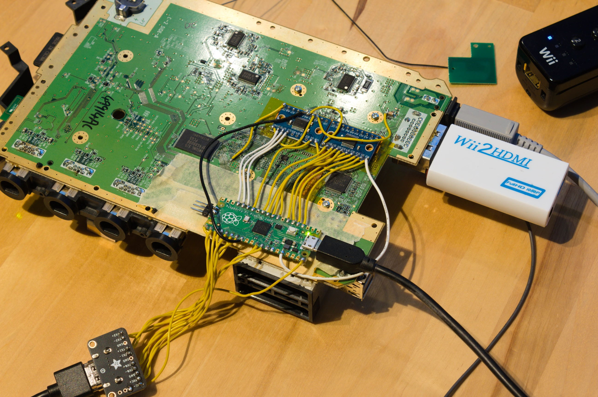

# picoAVE

A hardware/software HDMI mod designed for the Nintendo Wii based on the rp2040 microcontroller found on a Raspberry Pi Pico. Due to the readily available parts, this mod should be a lot cheaper to build compared to FPGA based solutions. It cost me less than 50€ to have two made, so only 25€ a piece. Sadly custom PCBs are necessary, as a stock pico board does not bring out the required clock input pin and is also too large to install inplace.

The CPU runs a parallel video processing pipeline across both cores to achieve full 720x480p 60Hz throughput without any color/information loss or other compromises. There is vsync by design, so tearing is impossible. A separate background task sends out audio packets in spare time.

> **[Look here](docs/impl_details.md) for in-depth implementation details.**

> [!WARNING]
> Currently the only supported mode is "EDTV / HDTV (480p)" as found in Wii settings.
> Any other mode results in no signal output!

## Building (software)

This is the same as any other pico project. You should probably edit the pico sdk path, too. It is absolutely crucial to build in release mode. Firmware flashing is covered [here](docs/building_hardware.md#flashing-firmware).

```bash
mkdir build
cd build
cmake -DCMAKE_BUILD_TYPE=Release -DPICO_SDK_PATH=/opt/pico-sdk/ ..
make
```

## Building (hardware)

> **[Look here](docs/building_hardware.md) for instructions.**

## Pictures

> Example raw frame captured from the Wii home menu with a cheap HDMI capture card. There is a small overlay with information about the current input signal, which disappears after a few seconds. Note, that the native aspect ratio is not 16:9.


> The first hardware revision, designed to solder directly onto a prototype flex pcb. The main pcb contains a rp2040, voltage level shifter, flash memory and LDO regulator. There is a second pcb for the HDMI mini output, connected by a 16 pin FFC. Wires are needed for GND, 5V, 1.8V and CLK connections. Firmware is flashed over a SWD header on the bottom left.


> The original prototype, still based on an actual pico board. Because the CPU clock ran unsynchronized to the video input, the HDMI signal dropped every few seconds (pipeline ran out of data). There are two TXS0108E voltage shifters to adapt the 1.8V signal levels of the GPU to 3.3V of a pico. Below is a custom flex pcb soldered directly to the board's vias. The Wii2HDMI is only used to force the Wii into 480p output mode. Original [Reddit post](https://www.reddit.com/r/wii/comments/1d0bm9p/picoave_a_new_wii_hdmi_mod_i_am_working_on/).
